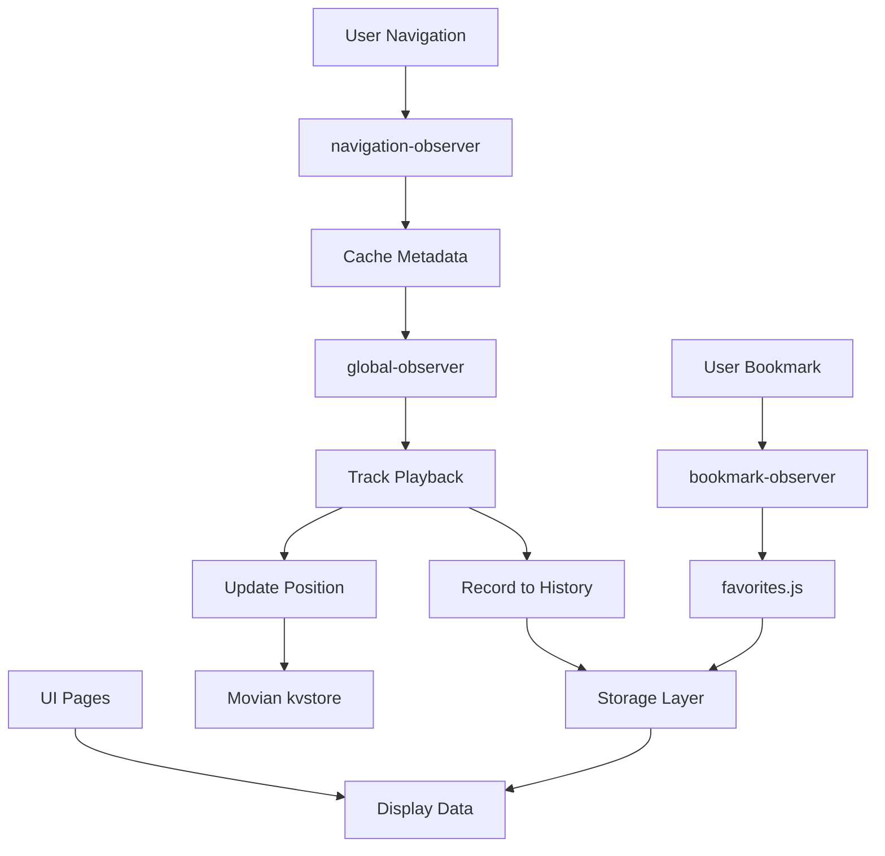

# 🎬 Movian Watch History Plugin

[](https://github.com/Buksa/movian-watch-history)
[](https://movian.readthedocs.io/)
[](https://opensource.org/license/mit)

> **Global watch history tracking for all Movian video sources** - Universal playback position tracking with continue watching and favorites management.

## ✨ Features

### 🎯 Core Functionality
- **🌐 Universal Tracking** - Works with HLS, MP4, UPnP/DLNA, torrents, and local files
- **⏯ Continue Watching** - Resume playback from any position (< 90% progress filter)
- **⭐ Smart Favorites** - Integration with Movian's bookmark star system
- **📊 Rich Metadata** - Title extraction, duration detection, icon caching
- **🔄 Real-time Updates** - Live position tracking and status updates

### 🏗 Advanced Architecture
- **🧠 Intelligent Caching** - Solves Movian's `currentpage.url` timing issue
- **⚡ Performance Optimized** - Lazy loading, efficient subscriptions, memory management
- **🛡️ Race Condition Prevention** - Atomic operations and proper synchronization
- **📦 ES5.1 Compliant** - Full compatibility with Movian's Duktape engine

### 🛠️ Development Tools
- **🔍 Syntax Validation** - ES5.1 compliance checking
- **📊 Property Monitoring** - Real-time Movian property observation
- **🧪 Comprehensive Testing** - Automated test scenarios and edge cases
- **📚 Complete Documentation** - Technical guides and API references

## 🚀 Installation

### Quick Install
1. **Download Plugin:**
   ```bash
   git clone https://github.com/Buksa/movian-watch-history.git
   ```

2. **Install in Movian:**
   - Open Movian
   - Navigate to Settings → Plugins
   - Click "Install from directory"
   - Select the cloned `movian-watch-history` folder

3. **Restart Movian** to complete installation

### Manual Install
Copy the entire `movian-watch-history` folder to:
```
~/.movian/plugins/
```

## 📖 Usage Guide

### Getting Started
1. **Enable Plugin:** Movian Settings → Watch History → "Enable watch history tracking"
2. **Access Features:** Navigate to the "Watch History" service in Movian's main menu
3. **Configure Settings:** Adjust history limits, favorites count, and debug options

### Main Features

#### 🏠 Dashboard
- **Recent Activity:** Last 5 items from continue/history/favorites
- **Quick Access:** One-click resume to unfinished content
- **Statistics Overview:** Total counts and usage metrics

#### ⏯ Continue Watching
- **Smart Filtering:** Only shows videos with < 90% progress
- **Position Memory:** Exact resume point with thumbnail
- **Auto-cleanup:** Removes completed items from continue list

#### 📚 Watch History
- **Complete Timeline:** All viewing activity with timestamps
- **Progress Tracking:** Visual progress bars for each entry
- **Search & Filter:** Find specific content quickly
- **Export Options:** Backup history data

#### ⭐ Favorites Management
- **Star Integration:** Uses Movian's native bookmark system
- **Quick Toggle:** Add/remove favorites with one click
- **Organized View:** Sort by date, title, or source
- **Bulk Operations:** Multiple selection and batch actions

### Advanced Features

#### 🔧 Configuration Options
- **History Limit:** 50-1000 entries (default: 200)
- **Favorites Limit:** 100-2000 entries (default: 500)
- **Debug Mode:** Detailed logging for troubleshooting
- **Auto-cleanup:** Automatic management of storage limits

#### 📊 Statistics & Analytics
- **Viewing Patterns:** Most watched content and times
- **Source Distribution:** Breakdown by content type
- **Progress Analytics:** Completion rates and abandonment
- **Storage Usage:** Current database size and limits

## 🏗 Architecture Overview

### 📁 Project Structure
```
movian-watch-history/
├── 📄 watchhistory.js          # Main entry point & service initialization
├── 📁 src/                    # Core logic modules
│   ├── 🌐 global-observer.js   # Universal playback tracking
│   ├── 🧭 navigation-observer.js # Metadata caching system
│   ├── 📚 history.js            # History CRUD operations
│   ├── ⭐ favorites.js          # Favorites management
│   ├── 🔖 bookmark-observer.js  # Movian star integration
│   ├── 💾 storage.js            # Safe kvstore wrapper
│   ├── 📝 log.js               # Debug logging system
│   └── 🛠️ utils.js             # Helper utilities
├── 📁 pages/                   # UI route handlers
│   ├── 🏠 home.js               # Dashboard view
│   ├── ⏯ continue.js            # Continue watching interface
│   ├── 📚 history.js            # History listing
│   └── ⭐ favorites.js          # Favorites management
├── 📁 dev/                     # Development tools
│   ├── 🔍 syntax-check.sh        # ES5.1 validation
│   ├── 📊 monitor_props.sh       # Property monitoring
│   └── 🧪 run-tests.sh           # Test suite runner
├── 📁 docs/                    # Technical documentation
│   ├── 📋 ARCHITECTURE.md        # System design
│   ├── 🧪 TESTING.md             # Testing guide
│   └── 📖 PROPSYSTEM_GUIDE.md   # Movian API reference
├── 📄 plugin.json              # Plugin metadata
├── 🖼️ watchhistory.svg          # Plugin icon
└── 📚 README.md                # This file
```

### 🔄 Data Flow Architecture



### 🧠 Technical Innovations

#### Metadata Timing Solution
**Problem:** Movian clears `currentpage.url` when playback starts, making metadata inaccessible.

**Solution:** Navigation observer caches metadata before URL clear:
```javascript
// Cache metadata when it first appears
navigationObserver.cacheMetadata(videoparams);

// Retrieve cached metadata in global observer
var cached = navigationObserver.getLastVideoParams();
```

#### Two-Tier Duration Detection
**Primary:** Fast extraction from videoparams
**Secondary:** Reliable subscription to `metadata.duration`

#### Safe Property Serialization
Movian Prop objects are proxies that break `JSON.stringify()`:
```javascript
function safeStringify(obj) {
    if (obj && typeof obj.valueOf === 'function' && 
        String(obj.valueOf()).match(/^\[prop/)) {
        return obj.toString(); // Convert to primitive
    }
    return JSON.stringify(obj);
}
```

## 🛠️ Development Setup

### Prerequisites
- **Movian Media Player** with plugin support
- **Git** for version control
- **Text Editor** with JavaScript syntax highlighting

### Development Workflow
1. **Clone Repository:**
   ```bash
   git clone https://github.com/Buksa/movian-watch-history.git
   cd movian-watch-history
   ```

2. **Development Mode:**
   ```bash
   # Run Movian with plugin in debug mode
   showtime -d -p .
   ```

3. **Syntax Validation:**
   ```bash
   # Check ES5.1 compliance
   ./dev/syntax-check.sh
   ```

4. **Testing:**
   ```bash
   # Run full test suite
   ./dev/run-tests.sh full local
   
   # Quick test with specific video
   ./dev/run-tests.sh quick upnp
   ```

5. **Debug Monitoring:**
   ```bash
   # Real-time property monitoring
   ./dev/monitor_props.sh
   ```

### Code Style Guidelines
- **ES5.1 Only:** No ES6+ features (no `let`, `const`, `=>`, classes)
- **CommonJS Modules:** Use `require()` and `exports`
- **2-space Indentation:** Consistent formatting
- **Comprehensive Comments:** Document complex logic
- **Error Handling:** Try/catch around Movian API calls

## 📚 API Documentation

### Public APIs
```javascript
// History management
exports.getHistory(filter, limit, callback);
exports.addToHistory(metadata, position, duration);
exports.clearHistory();

// Favorites management  
exports.getFavorites(callback);
exports.addToFavorite(metadata);
exports.removeFromFavorite(id);
exports.toggleFavorite(metadata);

// Continue watching
exports.getContinueWatching(callback);
exports.markCompleted(id);

// Utilities
exports.searchHistory(query, callback);
exports.exportHistory(format);
```

### Configuration Options
```javascript
// Global settings
settings.globalSettings('watch-history', 'Watch History', true);

// User preferences
settings.createBool('enabled', 'Enable tracking', true, callback);
settings.createInt('historyLimit', 'History limit', 200, 50, 1000, 50, '', callback);
settings.createInt('favoritesLimit', 'Favorites limit', 500, 100, 2000, 100, '', callback);
settings.createBool('debug', 'Debug mode', false, callback);
```

## 🔧 Troubleshooting

### Common Issues

#### Plugin Not Loading
**Symptoms:** Plugin doesn't appear in Movian
**Solutions:**
1. Check `plugin.json` syntax
2. Verify ES5.1 compliance: `./dev/syntax-check.sh`
3. Check Movian logs for errors
4. Ensure correct directory structure

#### History Not Recording
**Symptoms:** No entries in watch history
**Solutions:**
1. Enable debug mode: Settings → Watch History → Debug Mode
2. Check Movian logs for navigation observer errors
3. Verify property subscriptions are active
4. Test with different video sources

#### Position Not Saving
**Symptoms:** Resume doesn't work correctly
**Solutions:**
1. Check Movian kvstore permissions
2. Verify 150ms delay in position reading
3. Test with different video formats
4. Check metadata.duration subscription

#### Performance Issues
**Symptoms:** Slow UI or high memory usage
**Solutions:**
1. Reduce history limit in settings
2. Clear old entries manually
3. Disable debug mode
4. Check for memory leaks in logs

### Debug Mode
Enable detailed logging:
1. Movian Settings → Watch History → Debug Mode
2. Monitor logs in Movian console
3. Use development tools for deeper analysis

### Getting Help
- **Issues:** Report bugs at [GitHub Issues](https://github.com/Buksa/movian-watch-history/issues)
- **Discussions:** Use [GitHub Discussions](https://github.com/Buksa/movian-watch-history/discussions)
- **Logs:** Include debug output and Movian version in reports

## 🤝 Contributing

### Development Guidelines
1. **Fork Repository** and create feature branch
2. **ES5.1 Compliance** required for all changes
3. **Test Thoroughly** with `./dev/run-tests.sh`
4. **Documentation Updates** for new features
5. **Pull Request** with clear description

### Code Standards
- **Linting:** Run `./dev/syntax-check.sh` before commits
- **Testing:** Ensure all tests pass
- **Comments:** Document complex logic and edge cases
- **Backwards Compatibility:** Maintain existing API contracts

### Feature Contributions
- **Performance:** Optimizations and memory improvements
- **Compatibility:** Support for additional video sources
- **UI/UX:** Interface enhancements and usability
- **Analytics:** Advanced statistics and insights
- **Integration:** Connections with other Movian plugins

## 📄 License

This project is distributed under the
[MIT License](https://opensource.org/license/mit).

## 🙏 Acknowledgments

- **Movian Development Team** for the excellent media player platform
- **Movian Community** for feedback and testing
- **Duktape Project** for the lightweight JavaScript engine
- **Open Source Contributors** who helped improve this plugin

## 📞 Support

- **Documentation:** See `docs/` folder for detailed technical guides
- **Development Resources:** `AGENTS.md` and `CLAUDE.md` for AI assistance
- **Community:** [Movian Forums](https://www.movian.tv/) for general discussions
- **Issues:** [GitHub Issues](https://github.com/Buksa/movian-watch-history/issues) for bug reports

---

**⭐ If this plugin enhances your Movian experience, consider giving it a star on GitHub!**

**🔄 Made with ❤️ for the Movian community**
